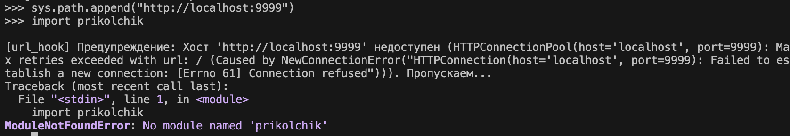

# Лабораторная работа 1. Реализация удаленного импорта
## Постановка задачи
1. Создать файл myremotemodule.py, который будет импортироваться, разместить его в каталоге, который далее будет "корнем сервера".
2. Разместить в нём следующий код:
```python
def myfoo():
    author = "" # Здесь обознаться своё имя (авторство модуля)
    print(f"{author}'s module is imported")
```
3. Создать файл Python с содержимым функций url_hook и классов URLLoader, URLFinder из текста конспекта лекции со всеми необходимыми библиотеками.
4. Далее, чтобы продемонстрировать работу импорта из удаленного каталога, запустить сервер http так, чтобы наш желаемый для импорта модуль "лежал" на сервере. 
5. Запуск файла с кодом из материала к лабораторной работе
6. Попытаемся импортировать myremotemodule.py, будет выведено
```
ModuleNotFoundError: No module named 'myremotemodule'
```
7. Выполнить код:
```python
sys.path.append("http://localhost:8000")
```
8. Протестировать работу удаленного импорта, используя в качестве источника модуля другие "хостинги" (например, repl.it, github pages, beget, sprinthost).
9. Переписать содержимое функции url_hook, класса URLLoader с помощью модуля requests (см. комменты).
10. Реализовать обработку исключения в ситуации, когда хост (где лежит модуль) недоступен.
11. Реализовать загрузку пакета, разобравшись с аргументами функции spec_from_loader и внутренним устройством импорта пакетов.

## Скриншоты
### Шаги 1-7


### Шаг 10

