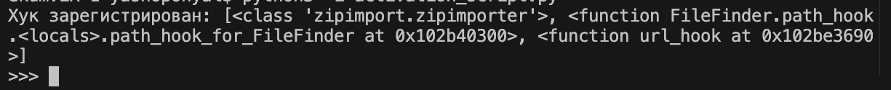
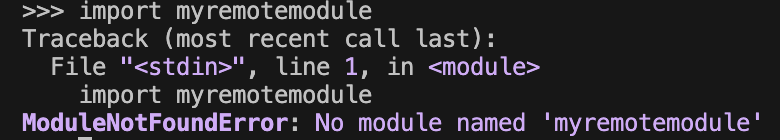
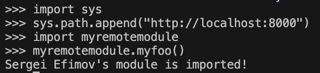

# Лабораторная работа 1. Реализация удаленного импорта
## Постановка задачи
1. Создать файл myremotemodule.py, который будет импортироваться, разместить его в каталоге, который далее будет "корнем сервера".
2. Разместить в нём следующий код:
```python
def myfoo():
    author = "" # Здесь обознаться своё имя (авторство модуля)
    print(f"{author}'s module is imported")
```
3. Создать файл Python с содержимым функций url_hook и классов URLLoader, URLFinder из текста конспекта лекции со всеми необходимыми библиотеками.
4. Далее, чтобы продемонстрировать работу импорта из удаленного каталога, запустить сервер http так, чтобы наш желаемый для импорта модуль "лежал" на сервере. 
5. Запуск файла с кодом из материала к лабораторной работе
6. Попытаемся импортировать myremotemodule.py, будет выведено
```
ModuleNotFoundError: No module named 'myremotemodule'
```
7. Выполнить код:
```python
sys.path.append("http://localhost:8000")
```
8. Протестировать работу удаленного импорта, используя в качестве источника модуля другие "хостинги" (например, repl.it, github pages, beget, sprinthost).
9. Переписать содержимое функции url_hook, класса URLLoader с помощью модуля requests (см. комменты).
10. Реализовать обработку исключения в ситуации, когда хост (где лежит модуль) недоступен.
11. Реализовать загрузку пакета, разобравшись с аргументами функции spec_from_loader и внутренним устройством импорта пакетов.

## Код activation_script.py (Шаги 1-10)
```python
import sys
import re
import requests
from importlib.abc import PathEntryFinder, Loader
from importlib.util import spec_from_loader


class URLLoader(Loader):
    def create_module(self, spec):
        return None

    def exec_module(self, module):
        origin = module.__spec__.origin
        try:
            response = requests.get(origin, timeout=3)
            response.raise_for_status()
            source = response.text
        except requests.RequestException as e:
            raise ImportError(f"Не удалось загрузить модуль из {origin}: {e}")

        code = compile(source, origin, mode="exec")
        exec(code, module.__dict__)


class URLFinder(PathEntryFinder):
    def __init__(self, url, available):
        self.url = url
        self.available = available

    def find_spec(self, name, target=None):
        if name in self.available:
            origin = f"{self.url}/{name}.py"
            loader = URLLoader()
            return spec_from_loader(name, loader, origin=origin)
        return None


def url_hook(some_str):
    if not some_str.startswith(("http://", "https://")):
        raise ImportError

    try:
        response = requests.get(some_str, timeout=3)
        response.raise_for_status()
        data = response.text
    except requests.RequestException as e:
        print(f"\n[url_hook] Предупреждение: Хост '{some_str}' недоступен ({e}). Пропускаем...")
        raise ImportError

    filenames = re.findall(r'[a-zA-Z_][a-zA-Z0-9_]*\.py', data)
    modnames = {name[:-3] for name in filenames}

    return URLFinder(some_str, modnames)

if url_hook not in sys.path_hooks:
    sys.path_hooks.append(url_hook)

print("Хук зарегистрирован! Текущие path_hooks:", sys.path_hooks)
```
## Скриншоты



